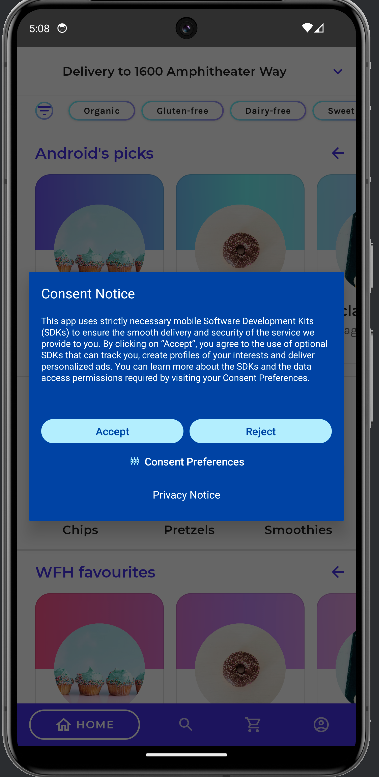
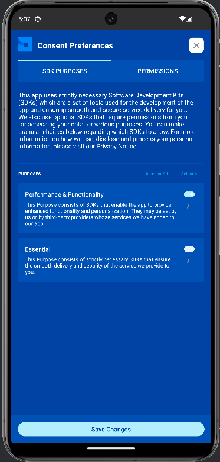
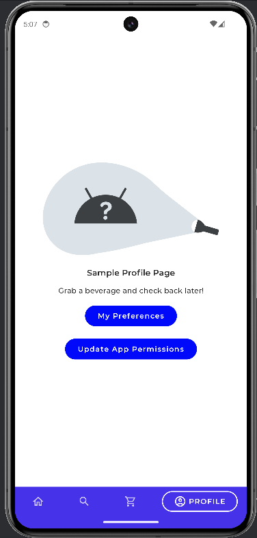

# Jetsnack sample

Jetsnack is a sample snack ordering app built with [Jetpack Compose][compose].

To try out this sample app, use the latest stable version
of [Android Studio](https://developer.android.com/studio).
You can clone this repository or import the
project from Android Studio following the steps
[here](https://developer.android.com/jetpack/compose/setup#sample).

This sample showcases:

* How to implement a custom design system
* Custom layout
* Animation

## Screenshots





### Status: 🚧 In progress 🚧

Jetsnack is still under development and some screens are not yet implemented.

## License

```
Copyright 2020 The Android Open Source Project

Licensed under the Apache License, Version 2.0 (the "License");
you may not use this file except in compliance with the License.
You may obtain a copy of the License at

    https://www.apache.org/licenses/LICENSE-2.0

Unless required by applicable law or agreed to in writing, software
distributed under the License is distributed on an "AS IS" BASIS,
WITHOUT WARRANTIES OR CONDITIONS OF ANY KIND, either express or implied.
See the License for the specific language governing permissions and
limitations under the License.
```

[compose]: https://developer.android.com/jetpack/compose
[coil]: https://coil-kt.github.io/coil/
